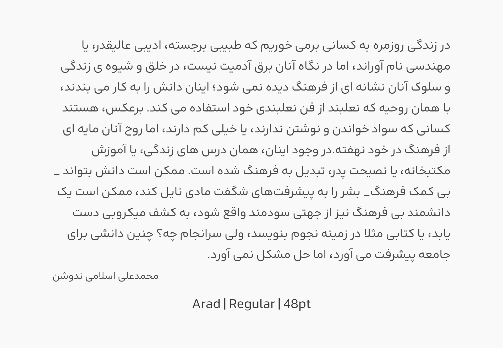

# Arad | آراد

آراد یک فونت آزاد هندسی، که ادامۀ پروژۀ فونت شبنم است. آراد در 8 وزن و سه استایل نقطه طراحی شده و از زبان های فارسی، عربی، کوردی، تورکجه و اردو پشتیبانی می‌کند. برای همنشین انگلیسی از فونت Kanit استفاده شده و چند تغییر کوچک بر روی ساختار آن شکل گرفته است.

## راهنمای انتخاب نسخه
### نسخۀ static یا variable؟
فونت هایی که ما به طور معمول استفاده می‌کنیم، بیشتر از نوع استاتیک هستند. فونت های استاتیک بیشترین پشتیبانی را در محیط های نرم‌افزاری مختلف دارند. اما اگر استفاده‌ای که از فونت دارید، مربوط به محیطی با پشتیبانی نرم‌افزاری از فونت های وربیل می‌شود، بهتر است بخاطر ویژگی های مثبت آن، از فونت های وربیل استفاده کنید. فونت های وربیل، فونت هایی هستند که چند حالت از فونت را در یک فایل فونت قرار داده اند. این موضوع موجب حجم پایین تر، و تعداد فایل پایین‌تر می‌شود. نکتۀ بعدی آن است که وزن، در فونت های وربیل، پیوسته است، و مانند نسخه های استاتیک گسسته نیست. یعنی برای مثال شما می‌توانید وزنی بین حالت بولد و اکسترابولد انتخاب کنید. در حال حاضر، بیشتر مرورگر ها، و برخی نرم‌افزار های گرافیکی از فونت های وربیل پشتیبانی می‌کنند.

### نسخه های misc چه تفاوتی با فونت عادی دارند؟
#### اعداد فارسی | FD
نسخۀ هک‌شده‌ای است، که به جای اعداد انگلیسی یا عربی، اعداد فارسی نوشته می‌شوند.

#### فاقد حروف انگلیسی | NE
نسخۀ هک‌شده‌ای است که حروف انگلیسی را ندارد. می‌تواند برای آنکه همنشین انگلیسی آن را خودتان انتخاب کنید، استفاده شود. همچنین به دلیل نداشتن گلیف های اضاف بیرای بعضی کاربرد ها، می‌تواند حجم کمتری داشته باشد.
