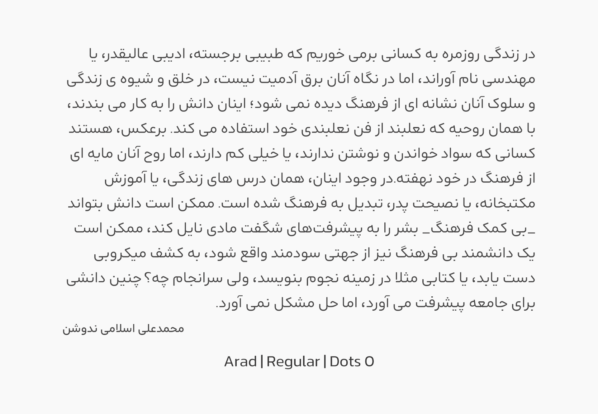

# Arad | آراد

آراد یک فونت آزاد هندسی، که ادامۀ پروژۀ فونت شبنم است. آراد در 8 وزن و سه استایل نقطه طراحی شده و از زبان های فارسی، عربی، کوردی، تورکجه و اردو پشتیبانی می‌کند. برای همنشین انگلیسی از فونت Kanit استفاده شده و چند تغییر کوچک بر روی ساختار آن شکل گرفته است.